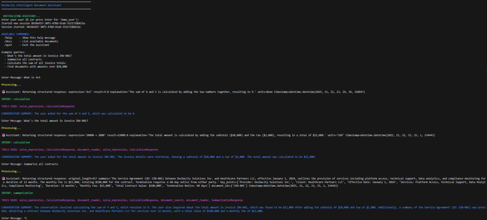

#### ND901 - Agentic AI Engineer with LangChain and LangGraph

# Project 1: Report Building Agent


## Prerequisites

This project is set up on top of the python tooling of [Astral.sh](https://astral.sh/), escpecially their package manager `uv`. If you have it already installed you can set up this project and install all dependencies by running the following command inside the root folder.

```
uv sync
``` 

## Running the Agent

After synchronizing your [pyproject.toml](pyproject.toml) as shown above you can run the agent on your terminal from the project root by simply running the [main.py](main.py)

```
python main.py
``` 

## Example Run




```
[
  {
    "timestamp": "2025-11-22T23:24:33.270411",
    "tool_name": "solve_expression",
    "input": {
      "expression": "4+5"
    },
    "output": "{'result': 9}"
  },
  {
    "timestamp": "2025-11-22T23:24:59.493174",
    "tool_name": "document_reader",
    "input": {
      "doc_id": "INV-001"
    },
    "output": "{'found': True, 'doc_type': 'invoice'}"
  },
  {
    "timestamp": "2025-11-22T23:25:00.181028",
    "tool_name": "solve_expression",
    "input": {
      "expression": "20000 + 2000"
    },
    "output": "{'result': 22000}"
  },
  {
    "timestamp": "2025-11-22T23:25:20.853692",
    "tool_name": "document_search",
    "input": {
      "query": "contracts",
      "search_type": "type",
      "doc_type": "contract",
      "min_amount": null,
      "max_amount": null,
      "comparison": null,
      "amount": null
    },
    "output": "{'results_count': 1}"
  },
  {
    "timestamp": "2025-11-22T23:25:21.671022",
    "tool_name": "document_reader",
    "input": {
      "doc_id": "CON-001"
    },
    "output": "{'found': True, 'doc_type': 'contract'}"
  }
]
```

## Architecture

Even through there is some branching in the designed workflow it is still pretty linear with three subsequent stages as shown in the graph below.
These stages are **Intent Classification**, **Intent Fulfillment** and **Memorization**.


### Intent Classification
On the first stage a [classify_intent](src/agent.py#L94) agent leverages a LLM (here GPT4o from OpenAI) to map the users natural language request into one of these [predefined classes](src/schemas.py#L72):
```
["qa", "summarization", "calculation", "unknown"] 
```

### Intent Fulfillment

After classifying the users intention the corresponding agent will be invoked. 
Each of these agents provides predefined LLM prompts to guide the intention and hooks the LLM up with two tools.
One for retrieving the documents to report on and another one for solving simple mathematical expressions (with guaranteed correctnes compared to letting the LLM solve these on its own).

See the graph above for routing based on intent class. The class `unkown` will also be routet the same as `qa`.

### Memorization

The last stage is updating the agents memory in [update_memory](src/agent.py#L217).

Here the LLM is called (by using a prompt template) to summarize the entire conversation so far. This summary will be stored alongside the referenced documents IDs and the invoked tools (although these are appended to the state already upon invocation).

For memorizing the `InMemorySaver` is being used which allows ephemeral memory for individual users. This is done by asking the user for a user ID upon startup.


## Design Decisions

### Schemas for Structured Output

All invocations are forcing the LLM to return structured output by providing a predefined schema.

### Pydandic vs TypedDict

Pydantic is being used over the more simple TypedDicts for schemas as these provide evaluation and constraints.

### User ID as Thread ID

The User ID is being used as *threadId* for the `InMemorySaver` in order to allow conversation memory for multiple users at once.

### Prompt Guidelines

Each agent prompt contains a section of strict guidelines the LLM should follow. This is especially important for guaranteeing tool invocation where the LLM might otherwise would try to solve a task on its own.